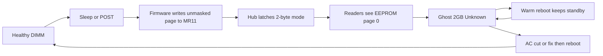

# Ghost DIMM

[](https://build.opensuse.org/package/show/home:fritz-fritz/am5-spd-diag)
[](https://hits.dwyl.com/fritz-fritz/am5-spd-diag)
[](https://github.com/fritz-fritz/am5-spd-diag/actions/workflows/github-code-scanning/codeql)

**Your DDR5 is fine. Firmware made a ghost.**  
After sleep on AMD AM5, BIOS can misread a real memory stick as an unknown 2 GB module.  
A restart does not fix it. Pulling the power does.

[What is this?](#what-is-this) · [Symptoms](#what-youll-see) · [Who it affects](#who-it-affects) · [What to do](#what-to-do) · [The tool](#am5-spd-diag) · [Logs](#logs) · [How it works](#how-it-works) · [Security](#is-this-a-security-issue) · [Data](#is-my-data-at-risk) · [Vendors](#for-firmware-vendors) · [FAQ](#faq) · [Development](#development)

---

The name comes from the write-up that first pinned this down: a [DDR5 module detected as a “2GB ghost DIMM” after S3 sleep on AM5](https://forum-en.msi.com/index.php?threads/ddr5-module-detected-as-2gb-ghost-dimm-after-s3-sleep-on-am5-root-cause-found.419787/). That post is the root-cause note. This repository is the Linux diagnostic that watches for it, captures evidence, and can unstick the hub without crawling under the desk.

## What is this?

You put the PC to sleep. You wake it. You reboot. POST takes longer than usual, BIOS complains that memory changed, and a stick that was 16 GB or 32 GB yesterday is now an **Unknown 2 GB** module. Task Manager, CPU-Z, and Linux all agree — because they are all reading the same lie from firmware.

The RAM is not dead. The SPD EEPROM on the stick is not corrupted. Firmware left the DIMM’s tiny SPD hub in the wrong addressing mode. From then on, every program that asks “what is this module?” is handed **page 0 of the datasheet** and told that is the whole story. Page 0 decodes as a 2 GB ghost: empty part number, serial `00206200`, 8-bit width.

That ghost lives on the DIMM’s **standby power**. A restart leaves standby up, so the ghost stays. Only cutting AC (or an in-band fix, then a reboot) clears it.

It is intermittent. The same sleep-and-reboot sequence can be fine one night and haunted the next. It is not a Linux bug, and it is not unique to one motherboard brand.

## What you'll see

Any of these, often together:


| Where           | Typical ghost                                                                 |
| --------------- | ----------------------------------------------------------------------------- |
| BIOS / Memory-Z | “Devices Changed (CPU or Memory)”, one slot is 2 GB Unknown                   |
| Windows         | Task Manager, CPU-Z, or HWiNFO show a 2 GB stick with no part number          |
| Linux           | `dmidecode` shows Unknown / 8-bit width / serial `00206200`; MemTotal dropped |
| Kernel log      | `spd5118 … Adapter does not support 16-bit register addresses`                |
| RGB / PSU       | DIMM LEDs still lit after a “power off” — standby was never cut               |


The machine often still **runs**. Training data can come from Memory Context Restore, so the sticks keep their speed even while identity and published capacity are wrong.

## Who it affects

**You are in the blast radius if most of this is true:**

- AMD **AM5** desktop (Ryzen 7000 / 9000), any mainstream board vendor
- **DDR5** UDIMMs whose SPD hub is an **SPD5118** (Montage silicon is common; G.Skill, Corsair, Kingston kits have all shown it)
- The PC **sleeps** (S3 / `deep`) or hits a **POST** path that re-reads SPD, then you **warm reboot**
- A full **power-off from the wall** makes the real kit come back

**You can ignore this if:**

- The board is not AM5, or the kit is not DDR5
- The “2 GB Unknown” survives an AC pull — that is a different failure (bad stick, bad slot, or a real SPD problem)
- Capacity is short for a reason you already know (iGPU reservation, EXPO/XMP not applied, one stick not seated)

Same DIMMs that ghost on AM5 have spent years in Intel systems without a single incident. The hub silicon is fine. The firmware that talks to it is not.

Reports span **MSI, ASRock, and Gigabyte**. That pattern points at **AMD AGESA / ABL**, not one vendor’s UEFI. MSI’s own SPD PEI module has an independent copy of the same mistake. Windows and Linux both observe it; the OS is not the writer.

## What to do

### 1. Get your RAM back (right now)

1. Shut the machine down.
2. **Flip the PSU switch or unplug the cord.** Wait a few seconds. If the DIMM RGB is still on, standby is still up — that does not count.
3. Power on. BIOS should see the real kit again (one long POST / “devices changed” is normal).

A restart from the OS is **not** a power cut.

### 2. Optional: unstick it without pulling the plug

On Linux, this repo’s `fix` command clears the stuck hub register, then you reboot. Details [below](#fix-without-pulling-the-plug).

### 3. Stop treating it as an RMA

Do not return the kit until you have reproduced the ghost, cleared it with AC, and seen the **same serials and part numbers** come back. The EEPROM was never rewritten.

### 4. If you want it fixed in BIOS

The durable fix is firmware: mask the SPD page to three bits, and write `MR11 = 0` early in POST so a stuck hub heals itself. That has to come from **AMD** (AGESA) and the **board vendor**. A vendor ticket is stronger if it includes a sleep/reboot timeline and a hub dump — which is what this tool is for.

---

## am5-spd-diag

A Linux helper for Ghost DIMM: it remembers what your kit looked like when it was healthy, checks again after sleep and reboot, and helps you build a vendor ticket if firmware starts lying.

Install it, then forget it until a notification shows up — or open **Ghost DIMM** from the application menu whenever you want a status check.

### Install

**Packages (recommended):** [Download for your distribution](https://software.opensuse.org/download/package?package=am5-spd-diag&project=home:fritz-fritz)

That page picks your distro (1-click install, zypper/apt, or a direct RPM/deb). [GitHub Releases](https://github.com/fritz-fritz/am5-spd-diag/releases) attach the same OBS-built packages for a tagged version.

**From source:**

```bash
git clone https://github.com/fritz-fritz/am5-spd-diag
cd am5-spd-diag
make build
sudo make PREFIX=/usr install
am5-spd-diag status
```

Build as your user. `sudo make install` only copies what you already built; it does not compile (root’s PATH usually cannot see `~/.local/bin/cargo`).

After install, captures run on their own:

- at boot and shutdown
- just before sleep
- just after resume

They land in `/var/log/am5-spd-diag/`. See [Logs](#logs) for who can read or write that tree.

```bash
sudo make PREFIX=/usr uninstall   # keeps logs
am5-spd-diag purge                # deletes captured evidence; does not uninstall
```

Install before you expect snapshots, Probe, or Fix to work. Running the binary from a git checkout is not enough — those actions only talk to the **installed** helpers.

### The window

**Ghost DIMM** in the application menu (or `am5-spd-diag open`) is the same views as the command line, laid out for a ticket. Status and Report use the last capture (plus live MemTotal on Status). CLI `report` snapshots first; the window Report and Package buttons do not. Probe is a live hub read.

If a capture finds the ghost **right now**, you get a persistent desktop notification. Click it and the window opens on status. Over SSH or on a console you get a journal line and a `wall` message instead — there is no banner to click.


| Button      | What it shows or does                                                                                                |
| ----------- | -------------------------------------------------------------------------------------------------------------------- |
| **Status**  | Healthy or not as of the last capture, plus live MemTotal                                                            |
| **Analyze** | Sleep/reboot history and hub evidence                                                                                |
| **Report**  | Markdown you can paste into a vendor ticket (last capture; no extra snapshot)                                        |
| **Probe**   | Live SPD hub registers (the stuck `MR11=0x08` check)                                                                 |
| **Fix**     | In-band MR11 clear — see [below](#fix-without-pulling-the-plug). Only enabled while identity is currently corrupted  |
| **Copy**    | Clipboard (markdown when you are on Report)                                                                          |
| **Package** | Evidence tarball from the last capture, then opens the folder                                                        |


Someone sent you a package? Open it with `am5-spd-diag open report --from FILE`. Fix and a fresh snapshot are disabled in that view: you are looking at their machine, not yours.

### The command line

Same views, printed to the terminal. `am5-spd-diag help` and `am5-spd-diag help <command>` match `-h`.


| Command                 | Purpose                                  |
| ----------------------- | ---------------------------------------- |
| `am5-spd-diag status`   | Healthy as of the last capture, plus live MemTotal |
| `am5-spd-diag analyze`  | History and hub evidence                 |
| `am5-spd-diag report`   | Snapshot, then ticket markdown           |
| `am5-spd-diag snapshot` | Capture now, no extra output             |
| `am5-spd-diag package`  | Snapshot, then tarball                   |
| `am5-spd-diag probe`    | Live hub registers                       |
| `am5-spd-diag fix`      | In-band MR11 clear; **does not reboot**  |
| `am5-spd-diag open`     | The window                               |
| `am5-spd-diag purge`    | Delete captured logs; does not uninstall |


`analyze`, `report`, and `open` take `--from FILE` to read a package instead of live logs. `report --from` prints markdown only unless you also pass `--out FILE`.

### Logs

systemd-tmpfiles owns `/var/log/am5-spd-diag/` (`0755 root:root` directories, `0644` files). **Any local user can list and read** captures, reports, and packages there (`ls`, `less`, a file manager). You do not need sudo to look. Board and DIMM serials are in those files, so on a shared machine prefer `package` and keep the tarball private.

Only root writes that tree: boot/sleep units and the passwordless snapshot helper. Unprivileged users cannot create or replace files there. That is deliberate — a user-writable log directory plus a root helper is a symlink-swap.

You do not have to browse the directory to use the tool. `status`, `analyze`, `report`, and **Package** already show the same evidence. `package` is the portable copy for a vendor ticket.

If the system directory is not writable, reports and packages go to `$XDG_DATA_HOME/am5-spd-diag/` (`~/.local/share/am5-spd-diag/` by default). Those files are yours.

`am5-spd-diag purge` asks for root to wipe `/var/log/am5-spd-diag` with systemd-tmpfiles first, then deletes your XDG data directory. If sudo fails, user reports stay. The wipe snippet is not in `tmpfiles.d`, so a normal boot does not empty the logs. Uninstall keeps them.

### Fix without pulling the plug

The window’s **Fix** button and `am5-spd-diag fix` are the same operation. Both warn, write MR11 only when it already reads `0x08`, record a `recover` timeline event, and tell you to **warm reboot**. Status/analyze/report will credit that clear plus reboot once identity looks healthy again.

```bash
sudo am5-spd-diag fix
# then reboot
```

> [!WARNING]
> This does not rewrite EEPROM. BIOS may show “Devices Changed” and retrain. A warm reboot is required after a successful clear. Sleep/wake is not enough.

### Passwords

Sitting at the machine, looking at status or taking a snapshot / probe: no extra password. **Fix** always asks for admin authentication — that write is the one that changes hub state.

Sleep and boot captures are automatic. They never pop a prompt.

### What a ticket contains

Board and DIMM serials are included so a vendor can match the kit. System UUID and asset tags are left out.

---

## How it works




### The hub, not the EEPROM

Each DDR5 UDIMM has an **SPD5118** hub — a small I²C device that exposes both live registers and 1024 bytes of SPD EEPROM, paged. Legacy readers (BIOS SMBIOS, CPU-Z, Linux `spd5118`) use **1-byte** addressing and pick a page by writing **MR11** (command `0x0B`).

Bit 3 of MR11 is **legacy 2-byte addressing**. When firmware accidentally sets it (`MR11 = 0x08`), the hub:

- Ignores 1-byte page selects
- Serves **EEPROM page 0** for every read
- Stays that way across S3 and warm reboot, because MR11 is volatile state on **VDDSPD** (standby). Bus Clear / Bus Reset do **not** clear it. Datasheet reset is VDDSPD < 0.3 V for ≥ 1 ms — which is why only an AC cut (or a careful in-band write) heals it

Nothing is programmed into the EEPROM. There is nothing to RMA.

### Why the ghost is always “2 GB / serial 00206200”

Page 0 really does hold base JEDEC fields. Blind readers decode that page as if it were the whole 1024-byte SPD:


| What firmware / CPU-Z reports         | Where it actually came from (SPD page 0)         |
| ------------------------------------- | ------------------------------------------------ |
| Manufacturing location “18”           | byte 2 = `0x12`                                  |
| Date “year 2002, week 4”              | bytes 3–4 = `02 04`                              |
| Serial `00206200`                     | bytes 5–8 = `00 20 62 00`                        |
| Empty part number                     | bytes 9+ are zeros                               |
| 2 GB, 1 rank, x8                      | density / organization bytes from the wrong page |
| DDR5-4800 JEDEC timings look “intact” | page 0 really does hold base JEDEC data          |


This repo flags **Unknown/missing part**, **8-bit width**, and that page-0 serial. Installed capacity is remembered from the last **healthy** capture, not assumed.

On Linux the smoking gun is:

```text
spd5118 1-0053: Adapter does not support 16-bit register addresses
```

That means MR11 bit 3 (`SPD5118_LEGACY_MODE_ADDR`) reads as 1, and the host SMBus controller cannot speak 2-byte addressing, so the driver gives up. A raw read of register `0x0B` returns `0x08`.

### Who writes the bit

Not the OS. The Linux `spd5118` driver masks page selects to bits `[2:0]` (or preserves bit 3). The forum author caught the latch during a **POST with Linux idle**: they had just cleared hub `0x53`, shut down with no suspend, and the next POST planted `0x08` on the *other* DIMM.

S3 resume is only the most common window. Firmware can write MR11 during ordinary POST.

### The firmware defect

Two independent implementations do the same thing:

1. **AMD ABL** (PSP-side memory init, including S3 resume) computes the SPD page as an unmasked `offset >> 7` and writes it to hub register `0x0B`. Two of three write paths have no `0x400` bound; the third does — the authors knew the boundary and guarded only one site.
2. **MSI** `MsiOcMemSPDPei` (x86 PEI, every POST, feeds SMBIOS / Memory-Z): `shr …, 7` with no `and …, 7`, then `EfiSmbusWriteByte` with command `0x0B`.

For an offset in `[0x400, 0x47F]` the computed “page” is exactly `0x08`. Bit 3 lands in the legacy-mode bit and latches the hub. Nothing in those firmwares suggests 2-byte mode is used on purpose.

The exact call chain that produces `offset >= 0x400` in the field is still a hypothesis. The arithmetic is not.

The Linux `spd5118` driver already [notes](https://github.com/torvalds/linux/commit/a852162efbff611ed49ae61a141e80c81689d54c) that some BIOS versions will not change addressing mode on a soft reboot — that is this aftermath. Upstream is also dropping the driver’s 16-bit fallback, so future kernels will not limp along with a stuck hub at all.

In-band fix (what `am5-spd-diag fix` does) writes a 16-bit SMBus word to a hub that is already in 2-byte mode, which that hub parses as “write `0x00` to MR `0x000B`”. Do not enable PEC on that write: the extra byte would be consumed as data and auto-increment into MR12. Probe and fix only touch motherboard SMBus adapters and SPD hubs the kernel already found (or dmesg reported as stuck). They do not scan empty `0x50–0x53` slots or talk to GPU / DesignWare buses. This tool does not reboot for you.

Full dumps, offsets, and the first documented in-band fix: **[MSI forum thread 419787](https://forum-en.msi.com/index.php?threads/ddr5-module-detected-as-2gb-ghost-dimm-after-s3-sleep-on-am5-root-cause-found.419787/)** (user **9950X3D**, 26 Jul 2026). Earlier symptom threads: [Level1Techs 229940](https://forum.level1techs.com/t/am5-linux-triggering-suspected-firmware-bug-with-s3-sleep/229940).

---

## Is this a security issue?

**It is a firmware integrity and availability defect.** It is not a remote exploit, and as diagnosed it is not a path to SMM or TEE takeover. There is **no CVE** for Ghost DIMM itself.


| Question                | Short answer                                                                                                                              |
| ----------------------- | ----------------------------------------------------------------------------------------------------------------------------------------- |
| Confidentiality         | Nothing shown. No secret leak.                                                                                                            |
| Integrity               | Firmware-visible DIMM identity (size, serial, part) is wrong. DRAM contents are not rewritten in the observed case. The EEPROM is intact. |
| Availability            | Yes: under-reported RAM, long POST, “Devices Changed”. Recoverable. It does not brick the DIMM.                                           |
| Remote attacker         | No network path. Firmware writes the bit during POST / S3 resume.                                                                         |
| Unprivileged local user | Not in the form that has been shown. SMBus usually needs root.                                                                            |
| Already root            | You can already poke the hub (that is how fix works). Local DoS of SPD identity until AC or a clear — you already had the machine.    |


AMD has assigned CVEs to **nearby** SPD / DIMM-bus problems. They are not this bug:

- [CVE-2024-36354](https://www.cve.org/CVERecord?id=CVE-2024-36354) — SPD *metadata not validated*; can break SMM isolation (physical / ring0 + non-compliant DIMM / BIOS root of trust)
- [CVE-2024-21944](https://nvd.nist.gov/vuln/detail/CVE-2024-21944) — SPD-trust / guest integrity on EPYC (BadRAM-adjacent). Search results sometimes conflate that with Ghost DIMM. It is not.
- [CVE-2025-48516](https://www.cve.org/CVERecord?id=CVE-2025-48516) — AGESA leaves the DDR5 **PMIC** unlocked on SMBus; local code can permanently damage the module. Same neighborhood, much worse outcome.

Ghost DIMM is the opposite of BadRAM in the observed case: it **under-reports** a real module by reading the **wrong page of a legitimate EEPROM**, rather than injecting attacker-controlled SPD that enlarges the map. Page 0 of a real JEDEC SPD is still valid JEDEC data, just the wrong slice.

A new CVE would appear only if AMD or an OEM accepted this as a security vulnerability and requested an ID. That is their call.

---

## Is my data at risk?

**Your files are not what this bug rewrites.** Ghost DIMM changes how firmware *names* a stick, not the contents of the stick’s EEPROM and not the documents on your disk.

> [!IMPORTANT]
> As diagnosed, this is a misread of the DIMM’s identity chip. It is not ransomware, not a disk-wiper, and not a leak of your documents over the network.


| What people worry about                          | What actually happens                                                                                                                                                                                                                                                   |
| ------------------------------------------------ | ----------------------------------------------------------------------------------------------------------------------------------------------------------------------------------------------------------------------------------------------------------------------- |
| “Did it scramble my SSD / photos / mail?”        | No. The bug lives on the DIMM’s tiny SPD hub. Storage devices are not in that path.                                                                                                                                                                                     |
| “Did it overwrite my RAM with garbage?”          | Not in the observed case. Training data often still comes from Memory Context Restore, so the kit keeps running at speed while SMBIOS tells a 2 GB lie.                                                                                                                 |
| “Did someone steal data through this?”           | Nothing shown. There is no network hook in the failure.                                                                                                                                                                                                                 |
| “Will `fix` or a power cut delete anything?” | `fix` only clears the hub’s addressing-mode register. An AC pull is the same reset the datasheet already requires. Neither formats a disk.                                                                                                                          |
| “So nothing bad can happen?”                     | You can lose **published capacity** until you clear the hub. A machine that thinks it has 34 GB instead of 64 GB can run out of RAM, refuse to sleep, or take a long POST. That is annoying and can crash apps. It is not silent corruption of files you already saved. |


If you had unsaved work in RAM and the session died because the OS suddenly saw less memory, that work is gone the same way it would be after any crash. Saved files, disk encryption, and backups are outside this bug.

The honest caveat: firmware *trusting* a wrong SPD page is a class of problem vendors have treated as security-relevant in other bugs ([see above](#is-this-a-security-issue)). Ghost DIMM’s demonstrated result is the **under-report** of a real module, not attacker-controlled SPD and not a known way to read your data. If that picture changes, this section should change with it.

---

## For firmware vendors

Firmware/UEFI is the authority for DIMM identity. Placeholder part/width fields are not a Linux memory-accounting bug. Linux is the observer: the same SPD5118 MR11 latch survives a warm reboot on any OS until VDDSPD power loss. A Windows-only check is not required to prove this.

Typical sequence: healthy baseline → sleep/wake → warm reboot (or POST) → Unknown/missing part and/or 8-bit width. A dirty power blip or crash with no ACPI poweroff capture is not the same as pulling the cord: 5VSB/VDDSPD may stay up (DIMM RGB often stays lit).

Please:

1. Mask SPD hub page selects to 3 bits (`page & 7`) on **every** MR11 write, including ABL silent paths.
2. Write `MR11 = 0x00` for each DIMM **early in POST**, before SMBIOS / Memory-Z reads, so a stuck hub is self-healing on the next boot.
3. Confirm AGESA / vendor SPD code on AM5 after S0ix/S3 and warm reboot.
4. If needed: this tool’s `report` / `package` output is meant to go on a ticket as-is.

---

## FAQ

**Is my RAM broken?**  
Almost certainly not, if an AC pull restores the real part numbers and serials.

**Why doesn’t Restart fix it?**  
The hub is powered from standby. Restart keeps that rail up. The wall has to go away.

**Is this Linux’s fault?**  
No. Firmware writes the register. Linux (and Windows) read whatever the hub then serves. Dual-boot does not clear it.

**Should I turn off sleep?**  
That avoids the most common trigger. It does not fix POST-time writes, and it does not unstick a hub that is already latched.

**Will** `fix` **brick the DIMM?**  
It only writes MR11 when it already reads `0x08`. It does not touch EEPROM. It is still experimental; the safe fix remains AC power.

**Is there a BIOS version that fixes it?**  
Not as of the forum author’s check through MSI BIOS 1.AA3 (June 2026), and not as a named AGESA fix we can point at. If a vendor ships a masked page-select, this README should say so.

**Where are the logs? Do I need root to read them?**  
No. `/var/log/am5-spd-diag/` is world-readable. `ls` and `less` work as your user. Writing there is root-only. `package` copies the same evidence into a tarball you own.

---

## Development

Source and issues: [github.com/fritz-fritz/am5-spd-diag](https://github.com/fritz-fritz/am5-spd-diag).

Build as your user with Rust (`cargo`), GTK4 (`gtk4-devel` / `libgtk-4-dev`), `pkg-config`, `python3`, and `make`.

```bash
make test
make build
```

`make test` runs the Rust suite plus packaging checks. `sudo make PREFIX=/usr install` only copies an already-built tree.

### Packaging

- RPM: `am5-spd-diag.spec` (OBS project `home:fritz-fritz`), **x86_64** (AM5)
- Debian: OBS `debian.*` + `am5-spd-diag.dsc` (debtransform); local `debian/` (`dh` + the same Makefile). Architecture `amd64`.
- Build: Rust (`cargo`), `gtk4-devel` / `libgtk-4-dev` for the notify window. `make dist` writes Source0 (no vendor) plus a vendor archive. OBS builds use a pinned official rustc as Source2 (`obs/rust-dist.txt`, `make osc-fetch-rust`). Dependabot bumps `rust-toolchain.toml`; CI and Release parse that channel into `dtolnay/rust-toolchain`. Debian 12 (oldstable, GTK 4.8) is included: the notify window uses `MessageDialog` there and `AlertDialog` on GTK 4.10+.
- Changelog source of truth is `am5-spd-diag.changes`. After editing it, run `python3 scripts/gen_changelogs.py` to refresh `debian.changelog`, `debian/changelog`, and the spec `%changelog`.
- Cut a release with `make bump TO=X.Y.Z MSG='...'`, merge to the default branch, then `git tag vX.Y.Z && git push origin vX.Y.Z`. Tags on a PR branch do not publish or commit to OBS. GitHub Actions uploads Source0, the vendor archive, and pinned rustc to OBS and attaches the packages to the GitHub Release.
- `dmidecode` is recommended. Capture reads SMBIOS from sysfs first and falls back to the `dmidecode` binary if the kernel table is unavailable.

## Credits

- **[MSI Forum's @9950X3D](https://forum-en.msi.com/index.php?threads/ddr5-module-detected-as-2gb-ghost-dimm-after-s3-sleep-on-am5-root-cause-found.419787/)** — root cause, ABL/PEI disassembly, and the first documented in-band MR11 clear
- [Level1Techs thread 229940](https://forum.level1techs.com/t/am5-linux-triggering-suspected-firmware-bug-with-s3-sleep/229940) — early multi-vendor symptom reports
- [Guenter Roeck, `spd5118`](https://github.com/torvalds/linux/commit/a852162efbff611ed49ae61a141e80c81689d54c) — 2024 note that some BIOS versions leave the hub in 2-byte (16-bit) addressing across a soft reboot, and that only a power cycle resets it

## License

[MIT](LICENSE)
